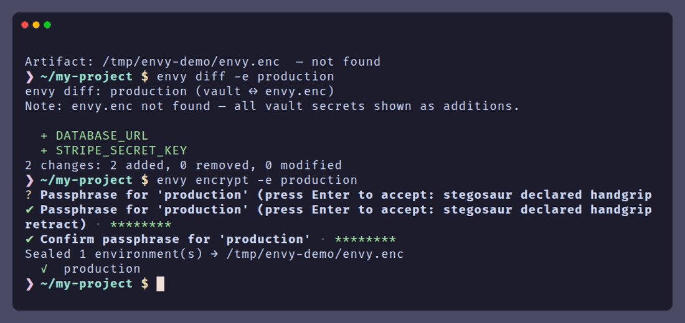

<div align="center">

<!-- Replace with your logo -->
<!--  -->

# envy

### Encrypted secrets, zero friction.

**Local-first secret management for teams who take security seriously.**
No SaaS. No internet. No plaintext — ever.

[](https://github.com/anguriatech/envy/actions/workflows/ci.yml)
[](https://github.com/anguriatech/envy/releases/latest)
[](LICENSE)

```bash
brew install anguriatech/tap/envy
```

```bash
npm install -g @anguriatech/envy
```

</div>

---

<!-- Replace with a demo GIF -->
<!--  -->

---

## The Problem

Every project starts with a `.env` file. Every `.env` file eventually ends up somewhere it shouldn't.

- **Committed to git** — accidentally or by a junior dev following a tutorial
- **Pasted in Slack** — "hey, can you check this config?" becomes a security incident
- **Left on disk** — cloned repos, CI artifacts, and Docker image layers carry your secrets forever
- **Shared as plaintext** — emailed, screenshot, airdropped, or typed into a Google Doc

The tools meant to solve this — hosted vaults, secrets managers, SaaS platforms — trade one risk for another: now your secrets live on someone else's server, behind their authentication, subject to their breach.

**There is no good reason for production secrets to ever exist in plaintext.** Envy makes that guarantee practical.

---

## Why Envy

<table>
<tr>
<td width="50%" valign="top">

### 🔐 Zero-Trust Storage

Secrets are encrypted with AES-256-GCM before they touch the database. The database itself is encrypted with SQLCipher. The master key lives exclusively in your OS Keychain — never written to any file, never exposed to the filesystem.

Stealing your `~/.envy/vault.db` gets an attacker nothing without the OS credential entry. Stealing your OS credential entry gets them nothing without the encrypted database. **Defense in depth, not defense by hope.**

</td>
<td width="50%" valign="top">

### 🧠 Memory-Safe Secret Injection

`envy run -- your-app` decrypts secrets in RAM and passes them to your process via `std::process::Command::envs()`. When the process exits, the memory is zeroed. Nothing is written to disk, shell history, or environment exports.

All secret values are wrapped in Rust's `Zeroizing<T>` — backing memory is overwritten to zero on drop, even if the program panics.

</td>
</tr>
<tr>
<td width="50%" valign="top">

### 🌿 GitOps-Native

`envy encrypt` produces `envy.enc` — a single JSON file sealed with Argon2id + AES-256-GCM. It contains **no key names, no values, no project identifiers**. Commit it to your public repo. Post it on Twitter. It is pure ciphertext.

`envy decrypt` on any machine restores your vault from the artifact. Onboarding a new team member is a `git pull` and one passphrase.

</td>
<td width="50%" valign="top">

### 🔬 Pre-Encrypt Audit Trail

`envy diff` shows exactly what will change before you seal — additions, deletions, and modifications — with `diff(1)` exit codes for CI/CD gating. Values are hidden by default. `--reveal` requires explicit opt-in with a stderr warning.

Know exactly what you're committing to the artifact before you commit it.

</td>
</tr>
<tr>
<td width="50%" valign="top">

### 🏢 Multi-Team Progressive Disclosure

Seal `development`, `staging`, and `production` with separate passphrases. A developer with the dev key imports their environment; `production` is listed as skipped — **not an error, not a prompt, not an alarm**. Access follows the passphrase, not a permissions UI.

</td>
<td width="50%" valign="top">

### 🤖 CI/CD Native, Zero Config

Set `ENVY_PASSPHRASE_<ENV>` in your pipeline's secret store. Envy detects it and goes fully headless — no TTY, no prompts, no code changes required. Works with GitHub Actions, GitLab CI, CircleCI, Jenkins, and any shell that supports environment variables.

</td>
</tr>
</table>

> **SOC 2 / Compliance note**: Envy eliminates the most common source of secret leakage — plaintext `.env` files in version control, chat logs, and build artifacts. It does not replace a full secrets management platform for regulated workloads, but it is a substantial step toward auditability: every secret change is a vault write, every seal is a committed `envy.enc` diff.

---

## Quickstart

**Step 1 — Install and initialise**

```bash
# Homebrew (macOS & Linux)
brew install anguriatech/tap/envy

# NPM (all platforms)
npm install -g @anguriatech/envy
```

> Windows, curl, or build-from-source? See the [Installation](#installation) section below.

```bash
cd my-project
envy init       # creates envy.toml (safe to commit)
```

**Step 2 — Store secrets and run your app**

```bash
envy set DATABASE_URL=postgres://localhost/myapp
envy set API_KEY=sk_live_abc123

envy run -- npm run dev
# secrets injected into the child process, never written to disk
```

**Step 3 — Seal and share with your team**

```bash
# Preview what you're about to commit
envy diff
#   + API_KEY
#   + DATABASE_URL
# 2 changes: 2 added, 0 removed, 0 modified

envy encrypt      # prompts for a passphrase (or set ENVY_PASSPHRASE in CI)

git add envy.enc envy.toml
git commit -m "chore: add encrypted secrets"
git push
```

A teammate pulls the repo and runs `envy decrypt`. Done. No Slack messages, no shared spreadsheets, no plaintext ever leaving your encrypted vault.

---

## Sync Status at a Glance

`envy status` tells you the state of every environment — no passphrase, no decryption.

```
$ envy status

+-------------+---------+------------------+----------------+
| Environment | Secrets | Last Modified    | Status         |
+=============================================================+
| development | 4       | 2 minutes ago    | ⚠ Modified     |
| production  | 3       | 3 days ago       | ✓ In Sync      |
| staging     | 2       | 1 week ago       | ✗ Never Sealed |
+-------------+---------+------------------+----------------+

Artifact: ./envy.enc  (last written: 3 days ago)
  Sealed environments: production
```

See **Modified**? Run `envy diff` to see exactly what changed, then `envy encrypt` to seal.

---

## CI/CD Integration

```yaml
# .github/workflows/deploy.yml
- name: Decrypt secrets
  env:
    ENVY_PASSPHRASE_PRODUCTION: ${{ secrets.ENVY_PASSPHRASE_PRODUCTION }}
  run: envy decrypt

# Gate on exact artifact state before deploying
- name: Assert no unsealed drift
  env:
    ENVY_PASSPHRASE_PRODUCTION: ${{ secrets.ENVY_PASSPHRASE_PRODUCTION }}
  run: |
    envy diff -e production          # exit 1 if vault ≠ artifact
    echo "✓ Artifact matches vault"

- name: Deploy
  run: envy run -e production -- ./scripts/deploy.sh
```

The `ENVY_PASSPHRASE_<ENV>` env var is the only config change required. Your application code and deploy scripts are untouched.

---

<details>
<summary><strong>📐 Architecture & Cryptography</strong></summary>

## How It Works

```
Local development:

  envy.toml             ~/.envy/vault.db              OS Keyring
  (project UUID)  →     (SQLCipher-encrypted DB)  ←   (32-byte master key)
                        AES-256-GCM per-secret
                        sync_markers (sealed_at per env)

Team sync via Git:

  ~/.envy/vault.db  →[envy encrypt]→  envy.enc (Argon2id + AES-256-GCM)
                                            │
                                       git commit/push
                                            │
                    ←[envy decrypt]←  envy.enc
```

### The Two-Key Model

| | Vault master key | Artifact passphrase |
|---|---|---|
| **Purpose** | Encrypts secrets at rest in `vault.db` | Encrypts `envy.enc` for sharing |
| **Stored in** | OS Keychain / Secret Service (never on disk) | Not stored — entered by user or `ENVY_PASSPHRASE` |
| **Scope** | Per machine, per user | Per team, per project |
| **Format** | 32 random bytes | Human-readable string |

These keys are entirely independent. Knowing the passphrase does not help with the vault. Copying the vault without the OS credential entry is useless.

### Cryptography Stack

```
Passphrase (user input)
    │
    ▼  Argon2id  (64 MiB memory, 3 iterations, parallelism 4)
256-bit derived key
    │
    ▼  AES-256-GCM  (random 96-bit nonce per seal)
Ciphertext + 128-bit authentication tag
    │
    ▼  base64ct  (constant-time Base64)
envy.enc  →  git commit
```

**Argon2id** is the Password Hashing Competition winner (2015). Memory-hard and side-channel resistant — GPU-based brute-force against the passphrase requires 64 MiB of RAM per attempt.

**AES-256-GCM** provides authenticated encryption — any modification to the ciphertext is detected before a single byte of plaintext is returned. This is what makes Progressive Disclosure safe: a wrong passphrase fails authentication silently, it never returns garbage data.

**Fresh nonce per seal** — re-sealing the same secrets produces different ciphertext every time. Ciphertext comparison attacks are not possible.

### The `envy.enc` Structure

```json
{
  "version": 1,
  "environments": {
    "development": {
      "ciphertext": "<base64>",
      "nonce":      "<base64>",
      "kdf": {
        "algorithm":    "argon2id",
        "memory_kib":   65536,
        "time_cost":    3,
        "parallelism":  4,
        "salt":         "<base64>"
      }
    }
  }
}
```

Every envelope is self-describing — it carries its own KDF parameters. You can decrypt any envelope without external metadata or a version registry. The `environments` map is a `BTreeMap` so JSON keys are always alphabetically ordered, producing deterministic `git diff` output.

### Memory Safety

Every secret value travels through the codebase in `zeroize::Zeroizing<String>`. When the container is dropped (on function return, scope exit, or panic), the backing memory is overwritten to zero by the OS. Secret values are never stored in a plain `String`.

</details>

---

<details>
<summary><strong>📋 Full Command Reference</strong></summary>

| Command | Alias | Description |
|---------|-------|-------------|
| `envy init` | — | Create `envy.toml`, register project in vault |
| `envy set KEY=VALUE [-e ENV]` | — | Store or update a secret |
| `envy get KEY [-e ENV]` | — | Print a single decrypted value to stdout |
| `envy list [-e ENV]` | `ls` | List all key names (values never printed by default) |
| `envy rm KEY [-e ENV]` | `remove`, `unset` | Delete a secret |
| `envy run [-e ENV] -- CMD` | — | Inject secrets and run a child process |
| `envy migrate FILE [-e ENV]` | — | Import all `KEY=VALUE` pairs from a `.env` file |
| `envy encrypt [-e ENV]` | `enc` | Seal vault into `envy.enc` |
| `envy decrypt` | `dec` | Unseal `envy.enc` and restore secrets |
| `envy export [-e ENV] [--format]` | — | Print all secrets to stdout (dotenv / JSON / shell) |
| `envy diff [-e ENV] [--reveal]` | `df` | Compare vault against `envy.enc` before encrypting |
| `envy status` | `st` | Show sync status dashboard (no passphrase required) |
| `envy completions SHELL` | — | Print shell completion script to stdout |

### Output Formats

Most read commands accept `--format` (or `-f`):

| Format | Description |
|--------|-------------|
| `table` | Human-readable (default) |
| `json` | Machine-readable JSON |
| `dotenv` | `KEY=value` pairs |
| `shell` | `export KEY='value'` — safe for `eval $(...)` |

### `envy diff` — the pre-encrypt review loop

```bash
# Table output (key names only, colored)
envy diff [-e ENV]

# With values (stderr warning emitted first)
envy diff [-e ENV] --reveal

# JSON for scripts — old_value/new_value absent without --reveal
envy diff [-e ENV] --format json
```

**Exit codes for `envy diff`**: `0` = no differences, `1` = differences found, `2+` = error.

### Shell Autocompletion

```bash
envy completions bash   >> ~/.bash_completion
envy completions zsh    >  ~/.zfunc/_envy      # then: autoload -Uz compinit && compinit
envy completions fish   >  ~/.config/fish/completions/envy.fish
envy completions powershell >> $PROFILE
```

### Legacy Migration

```bash
envy migrate .env              # import development secrets
envy migrate .env.staging -e staging
envy list                      # verify
rm .env .env.staging
echo '.env*' >> .gitignore
```

### Multi-Environment with Separate Passphrases

```bash
envy enc -e development    # dev passphrase
envy enc -e staging        # staging passphrase
envy enc -e production     # prod passphrase (restricted)

# Smart Merge: each seal preserves the other envelopes untouched
git add envy.enc && git commit -m "chore: rotate secrets"
```

```bash
# Junior dev — has only the dev key
envy decrypt
#   ✓  development   (4 secrets upserted)
#   ⚠  production    skipped — different passphrase or key
# exit code: 0  ← partial access is success
```

</details>

---

<details>
<summary><strong>🔢 Exit Codes</strong></summary>

| Code | Meaning |
|------|---------|
| `0` | Success; partial decrypt (≥ 1 env imported); `envy diff` — no differences |
| `1` | Not found (manifest, secret, `envy.enc`); zero envs imported; `envy diff` — differences found |
| `2` | Invalid input (key name, assignment format, empty or wrong passphrase) |
| `3` | Initialisation conflict; environment not found in vault or artifact |
| `4` | Vault or crypto failure |
| `5` | `envy.enc` unreadable (malformed JSON or unsupported schema version) |
| `127` | Child binary not found (`envy run`) |
| `N` | Child process exit code (proxied exactly by `envy run`) |

Note: `envy diff` follows the `diff(1)` convention — exit 1 means "differences exist", not "an error occurred". This makes it safe to use in shell pipelines with `||` without masking real errors.

</details>

---

## Installation

**Homebrew (macOS & Linux)**

```bash
brew install anguriatech/tap/envy
```

**NPM (Cross-platform wrapper)**

```bash
npm install -g @anguriatech/envy
# or run without installing:
npx @anguriatech/envy
```

**macOS & Linux (shell installer)**

```bash
curl --proto '=https' --tlsv1.2 -LsSf https://github.com/anguriatech/envy/releases/latest/download/envy-installer.sh | sh
```

**Windows (PowerShell)**

```powershell
irm https://github.com/anguriatech/envy/releases/latest/download/envy-installer.ps1 | iex
```

**Build from source** (requires Rust 1.85+)

```bash
git clone https://github.com/anguriatech/envy.git
cd envy && cargo install --path .
```

---

## Roadmap

Envy has completed **Phase 1** (encrypted local vault), **Phase 2** (GitOps sync & CI/CD), and **Phase 2.x** (multi-env encrypt, output formats, sync status, pre-encrypt diff).

**Phase 3 — Ecosystem & GUI**: An official VS Code Extension to make secret management visual and seamless, without leaving the editor.

---

<div align="center">

Built with Rust, SQLCipher, AES-256-GCM, and Argon2id by [Anguria Tech](https://github.com/anguriatech).
MIT License — audit the code, fork it, ship it.

</div>
